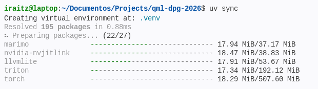
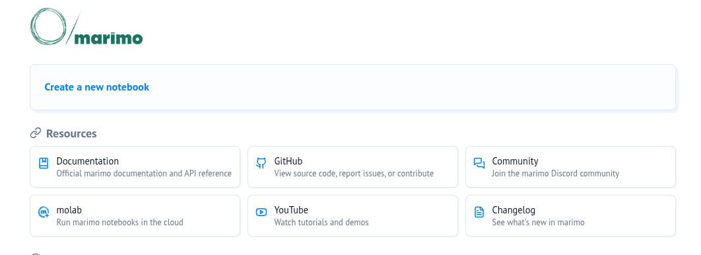
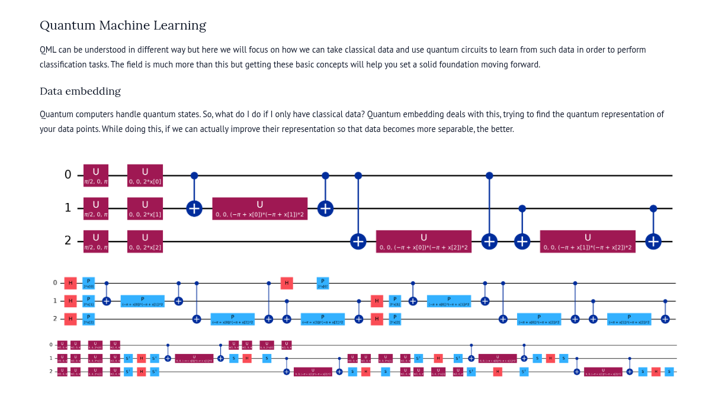
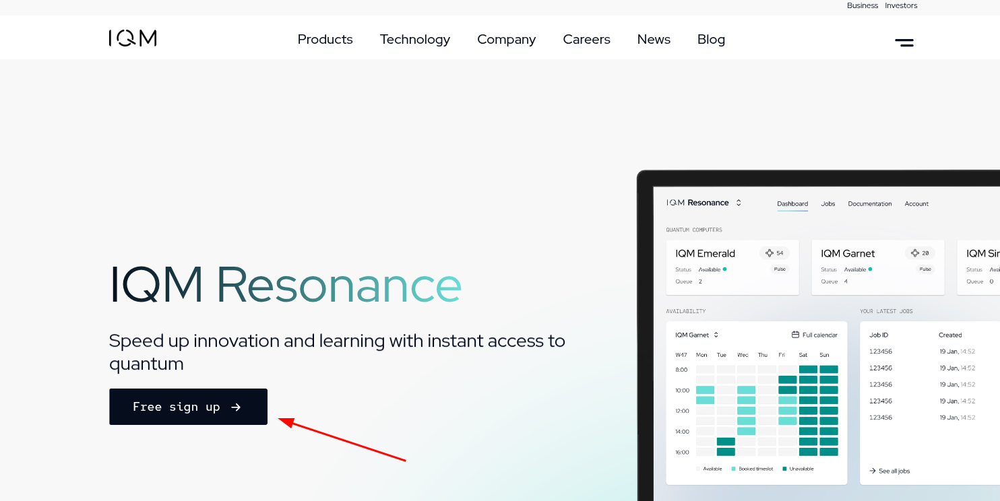
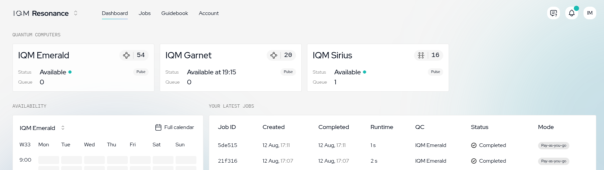
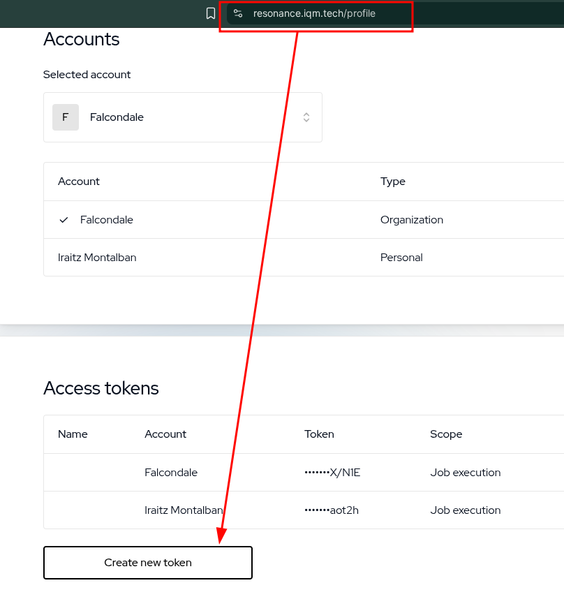
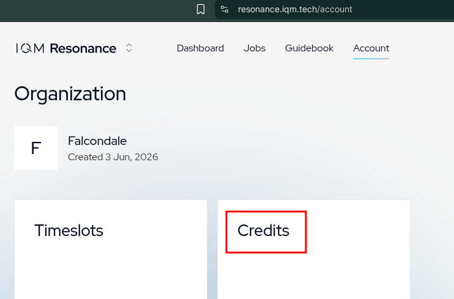

# Getting started

A short reference for setting up this repository locally and running the notebooks.
If you would rather not install anything, every notebook has an **Open in molab** or
**Open In Colab** badge in the [README](README.md), those run in the browser.

- [1. Clone the repository](#1-clone-the-repository)
- [2. Set up the environment with uv](#2-set-up-the-environment-with-uv)
  - [Alternative: pip and requirements.txt](#alternative-pip-and-requirementstxt)
- [3. Run the notebooks with marimo](#3-run-the-notebooks-with-marimo)
- [4. Register in IQM Resonance](#4-register-in-iqm-resonance)
- [Troubleshooting](#troubleshooting)

## 1. Clone the repository

You need [git](https://git-scm.com/downloads) installed.

```bash
git clone https://github.com/IraitzM/qml-dpg-2026.git
cd qml-dpg-2026
```

If you plan to keep your own changes, fork the repository on GitHub first and clone your fork instead, that way you can commit and push freely.

> The `data/` folder (MNIST) is git-ignored and downloaded on demand by the Session 3
> notebooks, so a fresh clone is small.

## 2. Set up the environment with uv

We use [uv](https://docs.astral.sh/uv/) as the package and Python manager. It resolves dependencies from `pyproject.toml`, pins them in `uv.lock`, and can install the right Python version for you (no `conda`, no manual `venv`).

### Install uv

```bash
# macOS / Linux
curl -LsSf https://astral.sh/uv/install.sh | sh

# Windows (PowerShell)
powershell -ExecutionPolicy ByPass -c "irm https://astral.sh/uv/install.ps1 | iex"
```

Check it worked:

```bash
uv --version
```

### Create the environment

From the repository root:

```bash
uv sync
```

This reads `pyproject.toml` + `uv.lock`, downloads Python 3.12 if you don't have it, and creates a `.venv/` folder with every dependency at the exact locked version.



> **Heads-up:** this pulls in `torch`, `pennylane-lightning-gpu` and friends, so the
> first sync downloads a few GB and takes a while. Later runs are cached and instant.

### Working with the environment

You don't need to activate anything, prefix commands with `uv run`:

```bash
uv run marimo edit
```

If you prefer an activated shell (or your IDE needs one), point it at `.venv`:

```bash
source .venv/bin/activate      # macOS / Linux
.venv\Scripts\activate         # Windows
```

Useful commands:

| Command | What it does |
| --- | --- |
| `uv sync` | Install/update the environment to match `uv.lock` |
| `uv run <cmd>` | Run `<cmd>` inside the environment |
| `uv add <package>` | Add a dependency (updates `pyproject.toml` and `uv.lock`) |
| `uv remove <package>` | Drop a dependency |
| `uv lock --upgrade` | Re-resolve to newer versions, then `uv sync` |
| `uv tree` | Show the dependency tree |

### Alternative: pip and requirements.txt

Don't want to install `uv`? The repo root also has a `requirements.txt`, exported straight from `uv.lock` (`uv export --no-hashes -o requirements.txt`), so it pins the exact same versions.

**Windows (PowerShell)**

```powershell
py -3.12 -m venv .venv
.venv\Scripts\Activate.ps1
pip install -r requirements.txt
```

If `py -3.12` isn't found, install Python 3.12 from [python.org](https://www.python.org/downloads/) (check "Add python.exe to PATH" during setup) or via `winget install Python.Python.3.12`.
If PowerShell blocks the activation script with an execution-policy error, run `Set-ExecutionPolicy -Scope Process -ExecutionPolicy Bypass` first, or activate with `.venv\Scripts\activate.bat` from `cmd.exe` instead.

**macOS / Linux**

```bash
python3.12 -m venv .venv
source .venv/bin/activate
pip install -r requirements.txt
```

Once activated, run commands directly (no `uv run` prefix needed):

```bash
marimo edit
```

> **Non-GPU devices:** `requirements.txt` marks the CUDA-only packages (`pennylane-lightning-gpu`, `pennylane-lightning-tensor`, and the `nvidia-*` / `cuda-*` wheels) with `sys_platform == 'linux'` environment markers, mirroring `pyproject.toml`. `pip` evaluates those markers and skips the packages automatically on Windows, macOS, or a Linux box without an NVIDIA GPU, no manual edits needed. The notebooks fall back to the CPU `lightning.qubit` device.

If you add or update dependencies with `uv`, regenerate the file so it stays in sync:

```bash
uv export --no-hashes -o requirements.txt
```

## 3. Run the notebooks with marimo

The notebooks live as **`.py` files**. Those are the [marimo](https://marimo.io) notebooks, and they are the source of truth. The matching `.ipynb` files are exports kept around so the Colab badges work.

marimo notebooks are reactive: change a cell and every cell that depends on it re-runs automatically. Because they are plain Python, they also diff cleanly in git.

### `marimo edit` : the interactive editor

Launch the notebook browser (a file explorer of all notebooks in the repo):

```bash
uv run marimo edit
```

Or open one notebook directly. Quote the path, the folder names contain a space:

```bash
uv run marimo edit "Session 1/1.1-Getting the basics.py"
```

marimo starts a local server and opens your browser at `http://localhost:2718`.



Handy flags:

```bash
uv run marimo edit --port 8080          # pick the port
uv run marimo edit --headless           # don't auto-open a browser
uv run marimo edit --watch <file.py>    # pick up edits made in your IDE
```

### `marimo run` : read-only app mode

Same notebook, but the code is hidden and you only see the outputs and widgets. This is the mode to use when presenting:

```bash
uv run marimo run "Session 1/1.3-QML.py"
```



## 4. Register in IQM Resonance

[IQM Resonance](https://www.iqm.tech/products/iqm-resonance) is the cloud service that gives access to IQM's superconducting devices — **Emerald**, **Garnet** and **Sirius**.

You need an account and an API token for the **Session 2** notebooks; Sessions 1 and 3 run fully on simulators and need none of this.

### Create the account

1. Go to **<https://resonance.iqm.tech/>** and sign up.
2. Confirm your email and complete the profile details.



Once you are in, the dashboard lists the available devices, their status and your job history.



### Generate an API token

From the dashboard, open your account/profile area and generate a new API token.



> **Copy it immediately.** The token is shown only once, at creation time. If you lose it, generate a new one.

### Use the token

The Session 2 notebooks read the token from the `IQM_TOKEN` environment variable, which
is what `iqm-client` looks for. They prompt for it with `getpass` so nothing is written
to disk:

```python
import os
from getpass import getpass

os.environ["IQM_TOKEN"] = getpass("Here goes your IQM API token:")
```

Then the connection itself:

```python
from iqm.qiskit_iqm import IQMProvider

IQM_URL = "https://resonance.meetiqm.com/"
QUANTUM_COMPUTER = "emerald"   # or "garnet", "sirius"

provider = IQMProvider(IQM_URL, quantum_computer=QUANTUM_COMPUTER)
backend = provider.get_backend()
print(f"Connected to : {backend.name}")
```

If you would rather not retype it every session, export it in your shell before
launching marimo:

```bash
export IQM_TOKEN="your-token-here"     # macOS / Linux
$env:IQM_TOKEN = "your-token-here"     # Windows PowerShell
uv run marimo edit
```

> **Never commit your token.** `.env` is git-ignored in this repo — keep it there or in your shell profile, and don't paste it into a notebook cell that gets saved.

### Watch your credits

Resonance access is metered in credits, and hardware jobs consume them per shot. Check the remaining balance in the dashboard before launching anything large.



Estimate the cost of a job first with IQM's
[resource calculator](https://www.iqmacademy.com/qpu/resourceCalculator/). Practical
rules of thumb: keep shot counts modest while debugging, run against `AerSimulator`
until the circuit is correct, and only then switch the backend to hardware.

## Troubleshooting

**`uv sync` fails on `pennylane-lightning-gpu`**: that wheel expects a CUDA-capable machine. On a laptop without an NVIDIA GPU, drop it: `uv remove pennylane-lightning-gpu`.
The notebooks fall back to the CPU `lightning.qubit` device.

**`pip install -r requirements.txt` fails on a CUDA/`nvidia-*` package**: this shouldn't happen on Windows or macOS since those lines carry a `sys_platform == 'linux'` marker that `pip` skips automatically. If it does happen on a GPU-less Linux box, open `requirements.txt` and delete the offending lines `pennylane-lightning-gpu`,`pennylane-lightning-tensor`, and any `nvidia-*` / `cuda-*` entries), then re-run `pip install -r requirements.txt`.

**`'python' is not recognized` / `py` not found (Windows)**: Python isn't on `PATH`, or only the Microsoft Store stub is installed. Install from [python.org](https://www.python.org/downloads/) with "Add python.exe to PATH" checked, then open a new PowerShell window.

**`marimo: command not found`**: you are outside the environment. Use `uv run marimo …` or activate `.venv` first.

**Port 2718 already in use**: a previous marimo server is still alive. Either stop it or pass `--port` with a free one.

**Paths with spaces**: the session folders are `Session 1`, `Session 2`, `Session 3`.
Always quote them: `uv run marimo edit "Session 2/2.1-Running on hardware.py"`.

**`401` / authentication errors against Resonance**: the token is missing, expired, or stored under the wrong name. The variable must be `IQM_TOKEN`. Re-run the `getpass` cell and check the token is still valid in the dashboard.

**Colab fails on the Session 2.2 notebook**: known incompatibility between Colab's IPython version and IQM's libraries. Use molab or a local run instead.
